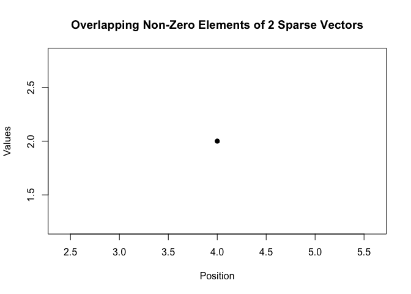

<!-- README.md is generated from README.Rmd. Please edit that file -->

# sparseNumeric

<!-- badges: start -->

[](https://github.com/anjieliu121/SDS375Homework5/actions/workflows/R-CMD-check.yaml)
<!-- badges: end -->

The goal of sparseNumeric is to provide an S4 representation of sparse
numeric vectors and a suite of arithmetic operations. A sparse vector
stores only its non-zero entries and their positions, allowing efficient
computation when most entries are zero.

## Installation

You can install the development version of sparseNumeric from
[GitHub](https://github.com/) with:

``` r
# install.packages("pak")
pak::pak("anjieliu121/SDS375Homework5")
```

## Examples

### Initialization

Initialize a sparse vector directly

``` r
library(sparseNumeric)
#> 
#> Attaching package: 'sparseNumeric'
#> The following object is masked from 'package:base':
#> 
#>     norm
v1 <- new("sparse_numeric",
value = c(3, 5),
pos = c(2L, 5L),
length = 6L)
v1
#> An object of class 'sparse_numeric'
#>  Length: 6 
#>  Non-zero positions: 2 5 
#>  Corresponding values: 3 5
```

Convert a dense vector to a sparse vector

``` r
dense <- c(0, 4, 0, 0, 7)
v2 <- as(dense, "sparse_numeric")

v2
#> An object of class 'sparse_numeric'
#>  Length: 5 
#>  Non-zero positions: 2 5 
#>  Corresponding values: 4 7
```

Convert a sparse vector back to a dense vector

``` r
as(v2, "numeric")
#> [1] 0 4 0 0 7
```

Display (show) a sparse vector

``` r
v2
#> An object of class 'sparse_numeric'
#>  Length: 5 
#>  Non-zero positions: 2 5 
#>  Corresponding values: 4 7
```

### Arithmetic Operations

Addition (generic + and sparse_add)

``` r
x <- as(c(0, 1, 0, 2, 0), "sparse_numeric")
y <- as(c(3, 0, 0, 1, 4), "sparse_numeric")

x + y
#> An object of class 'sparse_numeric'
#>  Length: 5 
#>  Non-zero positions: 1 2 4 5 
#>  Corresponding values: 3 1 3 4
sparse_add(x, y)
#> An object of class 'sparse_numeric'
#>  Length: 5 
#>  Non-zero positions: 1 2 4 5 
#>  Corresponding values: 3 1 3 4
```

Subtraction (generic - and sparse_sub)

``` r
x - y
#> An object of class 'sparse_numeric'
#>  Length: 5 
#>  Non-zero positions: 1 2 4 5 
#>  Corresponding values: -3 1 1 -4
sparse_sub(x, y)
#> An object of class 'sparse_numeric'
#>  Length: 5 
#>  Non-zero positions: 1 2 4 5 
#>  Corresponding values: -3 1 1 -4
```

Multiplication (generic \* and sparse_mult)

``` r
x * y
#> An object of class 'sparse_numeric'
#>  Length: 5 
#>  Non-zero positions: 4 
#>  Corresponding values: 2
sparse_mult(x, y)
#> An object of class 'sparse_numeric'
#>  Length: 5 
#>  Non-zero positions: 4 
#>  Corresponding values: 2
```

### Basic Operation

Count number of non-zero entries

``` r
count_sparse(x)
#> [1] 2
```

### Advance Operations

Mean of a sparse vector

``` r
mean(x)
#> [1] 0.6
```

Cross product

``` r
sparse_crossprod(x, y)
#> [1] 2
```

Euclidean Norm

``` r
norm(x)
#> [1] 2.236068
```

Standardize a sparse vector

``` r
standardize(x)
#> An object of class 'sparse_numeric'
#>  Length: 5 
#>  Non-zero positions: 1 2 3 4 5 
#>  Corresponding values: -0.6708204 0.4472136 -0.6708204 1.565248 -0.6708204
```

### Graphics

Plot overlapping non-zero elements of two sparse vectors

``` r
plot(x, y)
```


